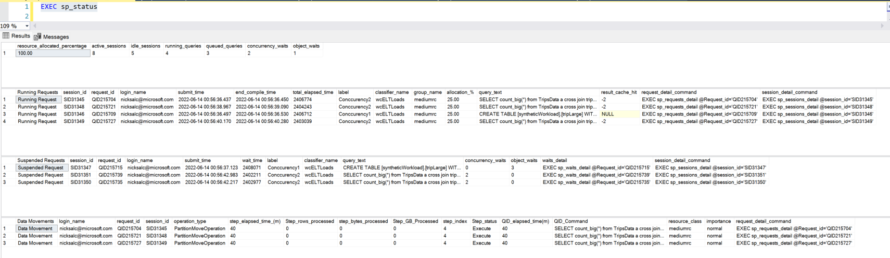

# Azure Synapse Toolbox

The Azure Synapse Toolbox is a place for useful tools and scripts to use with Azure Synapse Analytics. 

## Azure Resource Graph Queries

The Azure Resource Graph queries assist with gathering Azure tenant inventory for Azure resources related to Azure Synapse Analytics. They are intended to aid cost optimization, general inventory needs, normalizing or standardization of configuration, and more.

## Distribution Advisor

The Distribution Advisor (DA) feature of Azure Synapse SQL analyzes customer queries and recommends the best distribution strategies for tables to improve query performance. Queries to be considered by the advisor can be provided by the customer or pulled from historic queries available in DMV. See [Microsoft documentation](https://docs.microsoft.com/en-us/azure/synapse-analytics/sql/distribution-advisor) for more information

## Log Analytics Queries

Helpful KQL queries for querying diagnostic data that has been sent to Log Analytics for your serverless and dedicated SQL pools.

## Monitor Workbooks

In-depth, interactive workbooks for exploring monitoring data for your Serverless and Dedicated SQL Pools, Synapse Spark Pools, Synapse Pipelines, and ADLS storage. 

## PowerBI

PowerBI templates to monitor your Synapse Dedicated SQL Pool. PowerBI has the ability to query the front-end of your SQL endpoint as well as the back-end Log Analytics data so you can build powerful reports. 

## Synapse Analyzer

The Azure Synapse Analyzer Report was created to help you identify common issues that may be present in your database that can lead to performance issues. This report focuses on known best practices that Microsoft has identified with SQL Dedicated Pools. Following these best practices will help to get the best performance out of your solution. The Azure Synapse Best Practice Analyzer Report should help give you insights into the health of your database. We will continue to update the report to call out defined best practices that Microsoft has defined.

## Synapse Toolkit

The Synapse Toolkit is a set of stored procedures that help investigate
current activity on your Synapse Dedicated SQL Pool. sp_status is the overall
summary procedure that calls various other procedures to provide a picture
of current activity. Use the detail_command columns to deep dive into a 
particular session, query, or wait. 

List of SPs currently included:
- sp_status
- sp_concurrency
- sp_requests
- sp_reqeusts_detail
- sp_sessions
- sp_sessions_detail
- sp_waits
- sp_waits_detail
- sp_datamovement

## TSQL Queries

Helpful queries for managing and monitoring various aspects of your Dedicated SQL Pool. 

# Contributing

This project welcomes contributions and suggestions.  Most contributions require you to agree to a
Contributor License Agreement (CLA) declaring that you have the right to, and actually do, grant us
the rights to use your contribution. For details, visit https://cla.microsoft.com.

When you submit a pull request, a CLA-bot will automatically determine whether you need to provide
a CLA and decorate the PR appropriately (e.g., label, comment). Simply follow the instructions
provided by the bot. You will only need to do this once across all repos using our CLA.

This project has adopted the [Microsoft Open Source Code of Conduct](https://opensource.microsoft.com/codeofconduct/).
For more information see the [Code of Conduct FAQ](https://opensource.microsoft.com/codeofconduct/faq/) or
contact [opencode@microsoft.com](mailto:opencode@microsoft.com) with any additional questions or comments.
