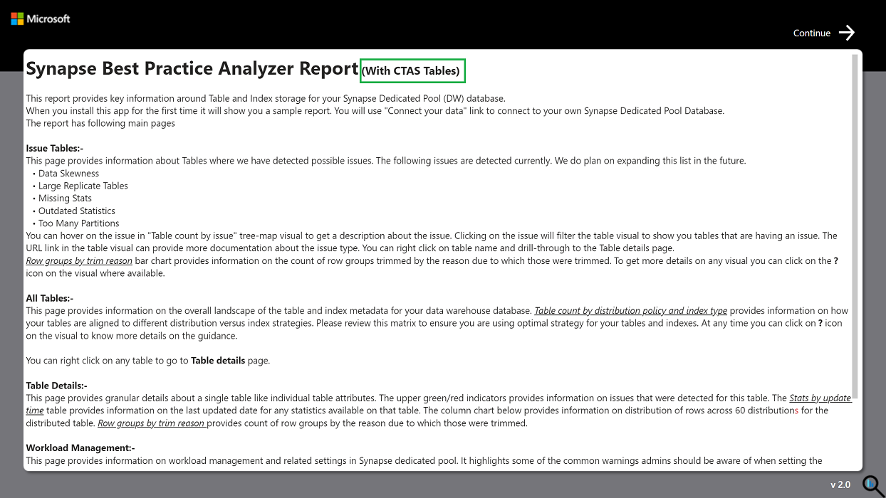

# Synapse Analyzer Report – for XL data warehouses.

## CTAS version for XL data warehouses
With this update we are also bringing a parallel copy of Synapse Analyzer report specifically targeted towards scenarios where Synapse Dedicated Pool database has greater than 20K tables and the normal refresh of synapse analyzer report times out after long period (greater than 5 hours)

For this version of the report the Synapse Admin has to run the Create table script on the dedicated Pool database which is being analyzed. The script will 

- a. Create new schema named “SynapseAnalyzer” under same database
- b. Execute Create Table as Select (CTAS) statements to create tables in SynapseAnalyzer schema and prepopulate it with details from the same database. 
- c. These tables are then used as source for the Power BI template file “Synapse best practice analyzer_with_CTAS.pbit” 
- d. The PBI template will then connect to SynapseAnalyzer schema and pull all the information from the tables that are prepopulated in above steps.  

**Important**: You need to run the scripts in given order.

1. The “CreateTablesForSynapseAnalyzer_CTAS.sql” script creates new schema named “SynapseAnalyzer” and then creates all required tables as a part of CTAS
2. Only after  step 1 above is successfully complete you can use “Synapse best practice analyzer_with_CTAS.pbit” for creating report using the PBI template file.

## Fixed error during desktop refresh 
For many users, running load data through Power BI desktop, the “Load Data” used to turn out into following error. 

    All Tables
    Loading blocked by failures with other queries.
    ColumnstoreDensity
    Query 'ColumnstoreDensity' (step 'Expanded All Tables') references other queries or steps, so it may not directly access a data source. Please rebuild this data combination.
    StatsSummary
    Loading blocked by failures with other queries.
    TableSizes
    Query 'TableSizes' (step 'Expanded All Tables') references other queries or steps, so it may not directly access a data source. Please rebuild this data combination.
    …

While there was a details section in Troubleshooting document on github location for troubleshooting this error, the overall first experience with tool was not optimal. With a new version of Synapse Analyzer report we have fixed this issue so you should not be getting the above error.

In future we plan to continue with more features and reports.

Thank you very much for using Synapse Analyzer. As always, we would be happy to receive any feedback you may have on the report. 

