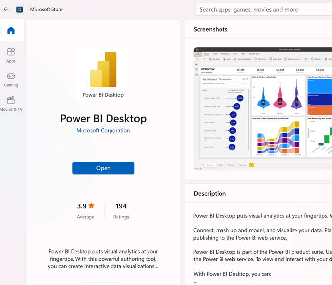
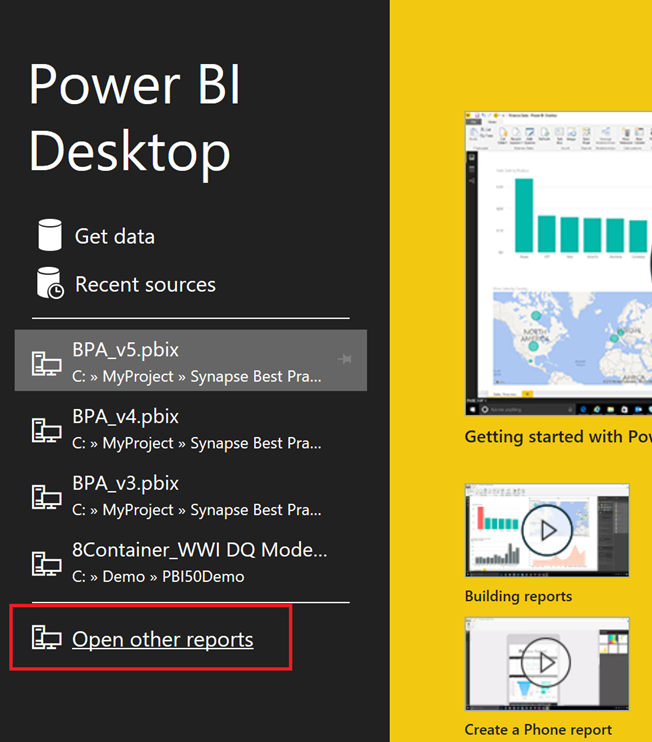
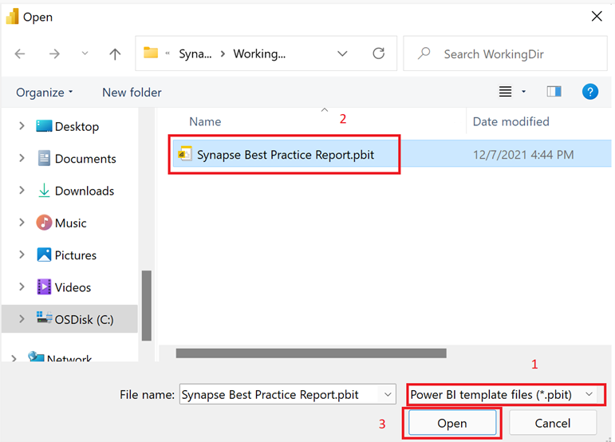
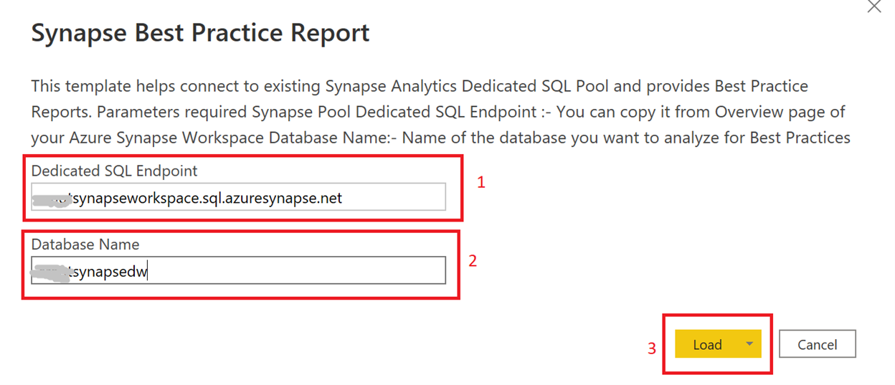
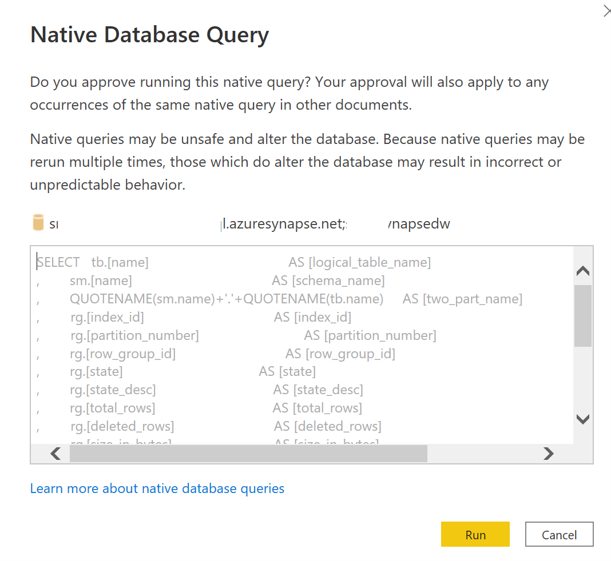
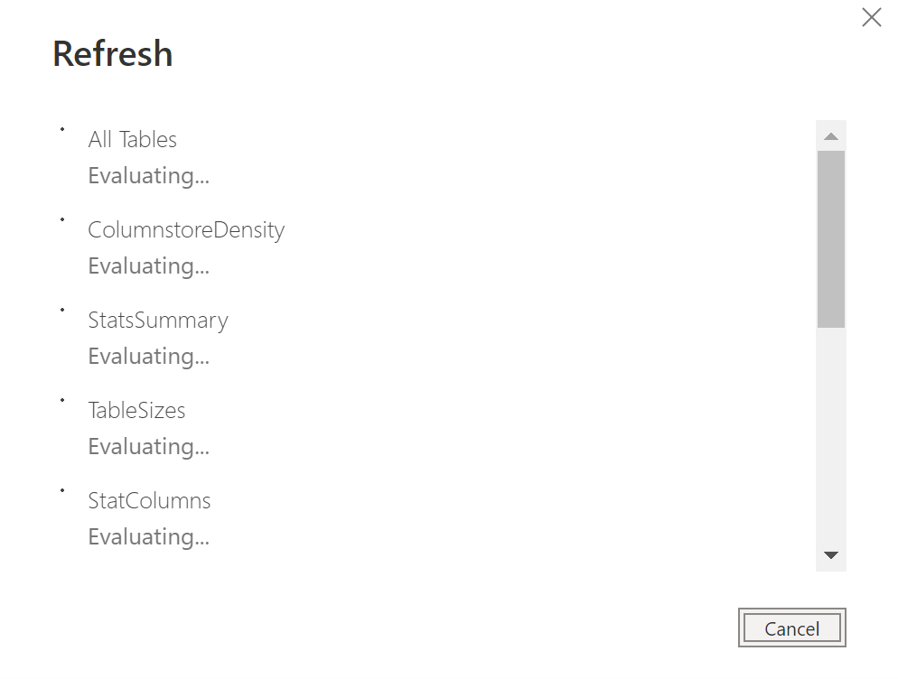

# Using Power BI Template (.pbit) for Synapse Best Practice Report

You can install and use Power BI Desktop to access Power BI Desktop template (.pbit) file.

1. From this GitHub location, download a Power BI template (.pbit) file named [**Synapse best practice analyzer.pbit**](./Synapse%20best%20practice%20analyzer.pbit "Synapse best practice analyzer.pbit"). 
2. You can use this pbit file through Power BI desktop (latest build). 
3. This step by step [installation guide](./InstallationGuide.md "InstallationGuide.md") will help you on installation, configuration and refresh of the report. 
4. If you face any errors in the process, the [troubleshooting guide](./TroubleshootingGuide.md "TroubleshootingGuide.md") will help you troubleshoot some of the common scenarios.

Below explains steps to install and run this report using Power BI template file (.pbit) from this location.

## Prerequisite

1. Latest version of Power BI Desktop App from [Microsoft Store](https://aka.ms/pbidesktopstore "Microsoft Store") on your PC. To configure Power BI desktop using Power BI desktop template (.pbit) file you need permission on your PC to run Power BI desktop.
2. Sysadmin privileges are required to capture information from Synapse dedicated pool. The person setting up refresh, and the credentials used for refresh, should have admin rights on Synapse Dedicated pool and its databases.
3. Consumers of this Report, however, could be non-admin based on who the report is shared with. 

## Installation

1. If not already done, install latest version of Power BI Desktop (Mar-2022 or greater).

2. Open Power BI Desktop on your PC,  
3. It will prompt you for Get Data screen. You can click on Open other reports link

4. Change file type from pbix to pbit (1)
5. Select “Synapse Best Practice Report.pbit” template file provided (2)

6. Click open (3)
7. Dialogue box for Synapse Best Practice report will open

8. Provide Synapse Dedicated Pool Endpoint (1) and Database Name (2) in the parameter text boxes
9. Click Load to open report (3)
10. If you are opening it for the first time it will pop up security warnings. This is because most of the data is collected using native database queries against DMVs. You need to allow each one permission to run by hitting 'Run' on the popup. Like an example below

11. Click “Try Again” to allow it to connect to Synapse Endpoint through Native Query.
12. This should start the refresh process.

13. Once refresh is complete click OK
