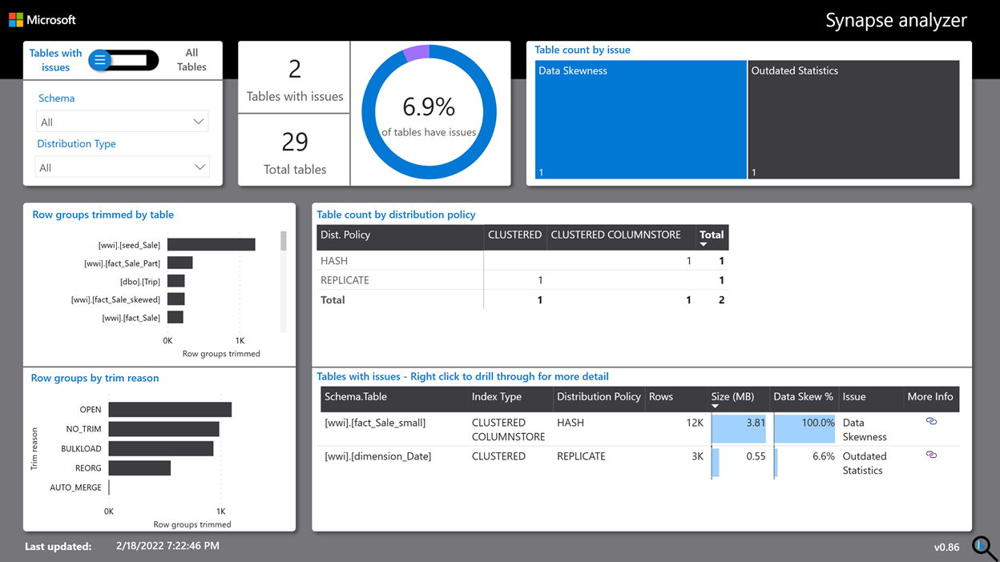
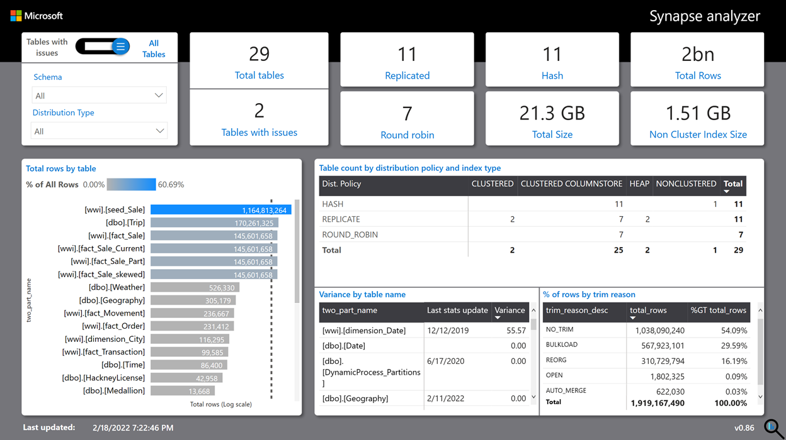
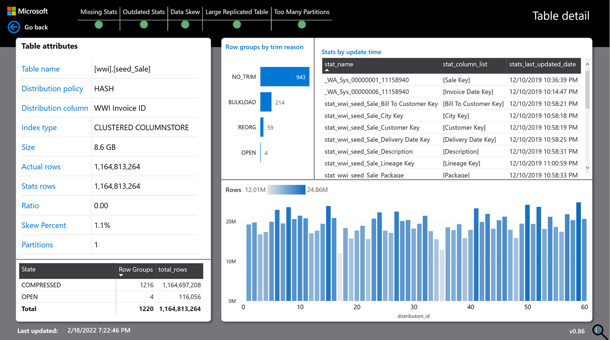
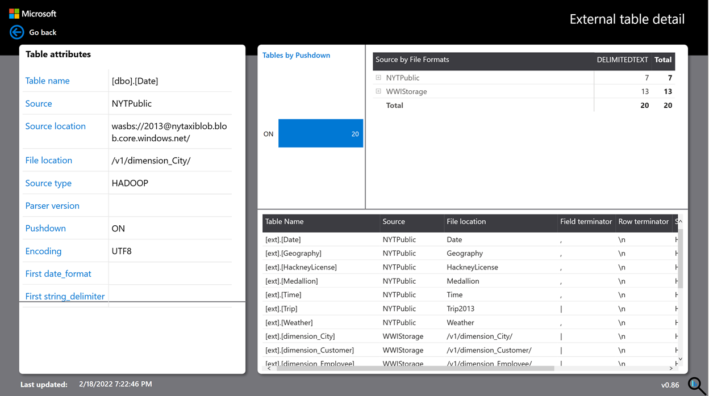

# Azure Synapse Analyzer Report to monitor and improve Synapse Dedicated Pool performance

The Azure Synapse Analyzer Report is created to help you identify common issues that may be present in your database that can lead to performance issues. This report focuses on known best practices that Microsoft has identified with SQL Dedicated Pools. Following these best practices will help to get the best performance out of your solution.

## Updated to Version 2.0

New version of Synapse Analyzer Report has been updated. Along with following detials, it includes reports related to **Workload Management** in Azure Synapse Analytics Dedicated SQL Pool. Please refer to [Updates to Synapse Analyzer Report](./UpdatestoSynapseAnalyzerReport.md "UpdatestoSynapseAnalyzerReport.md") document to know what is included in the new update. If you are reading it for the first time, then for overview of the overall report, please read through below before going to update section.

## Report Details

This report provides key information around Table and Index storage for your Synapse Dedicated Pool (DW) database. 

The report has following main pages:

	- About
	- Issue Tables
	- All Tables
	- Table Details
	- External Table Details
	- Workload management

### About

This page provides overall information about the report. 

### Issue Tables

This page provides information about Tables where we have detected possible issues. The following issues are detected currently. We do plan on expanding this list in the future.
- Data Skewness
- Large Replicate Tables
- Missing Stats
- Outdated Statistics
- Too Many Partitions

You can hover on the issue in "Table count by issue" tree-map visual to get a description about the issue. Clicking on the issue will filter the table visual to show you tables that are having an issue. The URL link in the table visual can provide more documentation about the issue type. You can right click on table name and drill-through to the Table details page.

Row groups by trim reason bar chart provides information on the count of row groups trimmed by the reason due to which those were trimmed. To get more details on any visual you can click on the ? icon on the visual where available.

### All Tables

This page provides information on the overall landscape of the table and index metadata for your data warehouse database. Table count by distribution policy and index type provides information on how your tables are aligned to different distribution versus index strategies. Please review this matrix to ensure you are using optimal strategy for your tables and indexes. At any time you can click on ? icon on the visual to know more details on the guidance.

You can right click on any table to go to Table details page.

### Table Details

This page provides granular details about a single table like individual table attributes. The upper green/red indicators provides information on issues that were detected for this table. The Stats by update time table provides information on the last updated date for any statistics available on that table. The column chart below provides information on distribution of rows across 60 distributions for the distributed table. Row groups by trim reason provides count of row groups by the reason due to which those were trimmed.

### External Table Details

This table provides metadata information on external tables present in the database like the source of external table, file format, source locations etc.

## Best Practice Rules

The rules created will validate Best Practices rules against the set of conditions to flag an issue.

The 5 rules that have been incorporated today are:

| Issue  | Issue Description  |
| ------------ | ------------ |
| **Data Skewness**  | This is a scenario when data is distributed unequally among 60 distributions. A heavy skew can negatively impact queries involving that table. And in most cases, data skew can be avoided by choosing the correct distribution column. See how to [choose a distribution column](https://docs.microsoft.com/azure/synapse-analytics/sql-data-warehouse/sql-data-warehouse-tables-distribute#choose-a-distribution-column "choose a distribution column") for more information.  |
| **Large Replicated Tables**  | Replicated tables help in avoiding the shuffle of data by maintaining a full copy of the table on each Compute Node. Due to the overhead involved in broadcasting the whole table, it is recommended to replicate a table that is < 2GB and infrequently updated. For more details, please refer [design guidance for replicated tables](https://docs.microsoft.com/azure/synapse-analytics/sql-data-warehouse/design-guidance-for-replicated-tables "design guidance for replicated tables").  |
| **Missing Stats**  | If statistics are missing and the database AUTO_CREATE_STATISTICS option is on, dedicated SQL pool analyzes incoming user queries for missing statistics. The query optimizer creates statistics on individual columns on the query predicate or join condition to improve cardinality estimates for the query plan. Automatic creation of statistics is done synchronously so you may incur slightly degraded query performance if your columns are missing statistics. To avoid measurable performance degradation, you should ensure stats have been created first by executing the benchmark workload before profiling the system. Check [SQL data warehouse tables statistics](https://docs.microsoft.com/azure/synapse-analytics/sql-data-warehouse/sql-data-warehouse-tables-statistics "SQL data warehouse tables statistics") to learn more.  |
| **Outdated Statistics**  | SQL Pool uses a cost-based query optimizer which uses statistics to generate an optimal query execution plan. In the case of outdated/missing statistics, the SQL engine can choose a wrong execution plan leading to performance issues. Check [SQL data warehouse tables statistics](https://docs.microsoft.com/azure/synapse-analytics/sql-data-warehouse/sql-data-warehouse-tables-statistics "SQL data warehouse tables statistics") to learn more.  |
| **Too Many Partitions**  | For a Columnstore table, it highly recommended to have 1 million rows per row-group for better compression & performance. SQL Pool internally divides each table into 60 child-tables ( aka distribution), and a partition further divides these child tables by partition column. It would be best if you aimed to have 1 Million or more rows per partition per distribution. Refer [Data warehouse tables partition](https://docs.microsoft.com/azure/synapse-analytics/sql-data-warehouse/sql-data-warehouse-tables-partition "Data warehouse tables partition") for details.  |

## Installation 

You can install and use Power BI Desktop to access Power BI Desktop template (.pbit) file.

1. From this GitHub location, download a Power BI template (.pbit) file named [**Synapse best practice analyzer.pbit**](./Synapse%20best%20practice%20analyzer.pbit "Synapse best practice analyzer.pbit"). 
2. You can use this pbit file through Power BI desktop (latest build). 
3. The step by step [installation guide](./InstallationGuide.md "InstallationGuide.md") will help you on installation, configuration and refresh of the report. 
4. If you face any errors in the process, the [troubleshooting guide](./TroubleshootingGuide.md "troubleshootingGuide.md") will help you troubleshoot some of the common scenarios.

## Required Permissions

- To configure Power BI desktop using Power BI desktop template (.pbit) file you need permission on your PC to run Power BI desktop.

- To connect to Azure Synapse Dedicated Pool data warehouse endpoint and refresh report you need to provide data source credentials. For those credentials Sysadmin privileges are required to capture information from Synapse dedicated pool. 

- Consumers of this Report, however, could be non-admin based on who the report is shared with. 

## Schedule Refresh from Power BI Service (Optional)

While you can use Power BI desktop report occasionally, for scheduled report and broader access to the report, we recommend publishing report to Power BI Service using Publish option in Power BI desktop. To publish pbix file to Power BI service and refresh dataset from service user need Power BI Pro user privileges. [Publish Azure Synapse Analyzer Report to Power BI service](./PublishToPowerBIService.md "PublishToPowerBIService.md") provides step-by-step instructions.

Please note: While setting up refresh of dataset in Power BI Service, the credentials used for refresh, should have admin rights on Synapse Dedicated pool and its databases.

## Update to Version 2.0

New version of Synapse Analyzer Report has been uploaded. It includes reports related to Workload Management in Azure Synapse Analytics Dedicated SQL Pool. Please refer to [Updates to Synapse Analyzer Report](./UpdatestoSynapseAnalyzerReport.md "UpdatestoSynapseAnalyzerReport.md") document for more details. 

## Summary 

The Azure Synapse Analyzer Report should help give you insights into the health of your Azure Synapse Dedicated Pool database. We will continue to update the report to call out defined best practices that Microsoft has defined. 

