# Troubleshooting errors when refreshing report from Power BI Desktop

During the refresh you may encounter Errors. This document lists some of the common errors and possible troubleshooting steps for those errors.

## Connection Errors when refreshing report from Power BI Desktop

Sometimes you may receive errors while connecting to your Synapse Dedicated Pool database.

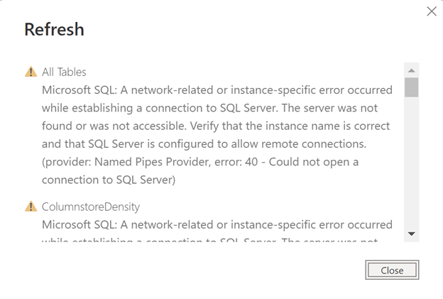

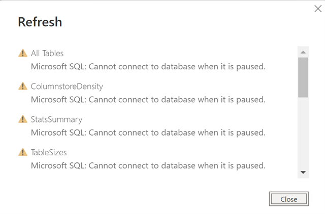

If you receive any of the above connection errors, please ensure that

1. You have provided correct connection parameters for Server endpoint and database
2. The given database on the synapse workspace is online and running
3. You have provided appropriate credentials to be used to connect to the database
4. The credentials provided have admin access to the Synapse data warehouse database.

You can close Power BI desktop without saving and open pbit file again from Power BI Desktop.

## Timeout errors when refreshing report from Power BI Desktop

You may encounter Timeout error when refreshing Power BI report from Power BI desktop. 

If you click close on the error dialog you will see following on the Power BI desktop 

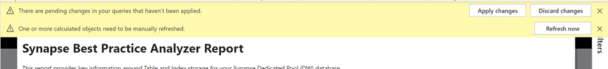

At this time you can try following troubleshooting steps based on situations
1. Check if the Azure Synapse Dedicated Pool database is online and accepting connections
2. Check if database is too busy with other requests. You can refresh the report towards off peak hours to ensure it pulls all the data
3. If refresh is timing out after it starts loading data, 

You can save the failed refresh desktop file without applying changes and upload pbix file to Power BI workspace (preferably Power BI Premium) and refresh from there. For that

Save file on your desktop. While saving it will ask for applying changes, choose apply later

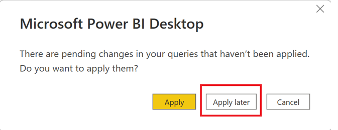

Publish file to Power BI Workspace. We would prefer using Power BI Premium since Premium datasets have higher timeout value and also higher processing power to execute refresh. While publishing it may again ask you to save file and pop up the same dialog as above step. You can click “Apply later”.

After successfully publishing PBI desktop file, go to the premium workspace where you published the file. Click more options on the dataset and go to dataset settings 

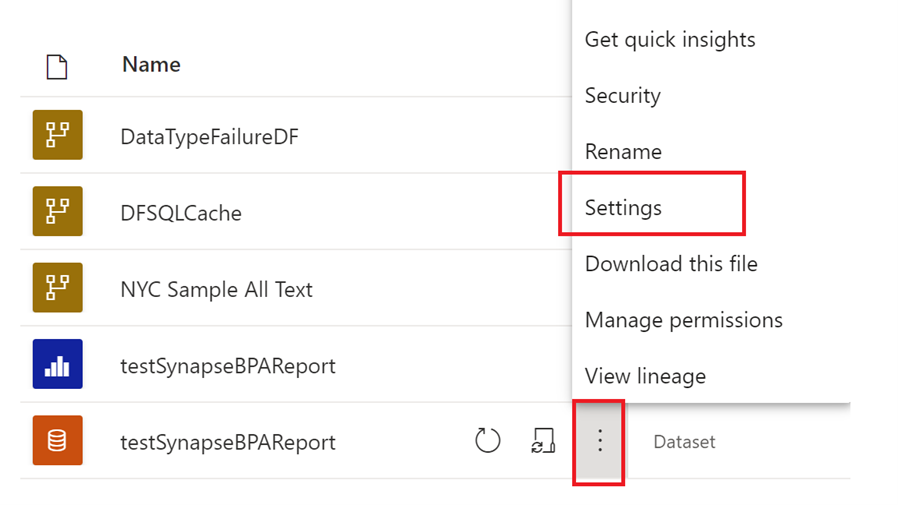

Under the dataset settings, you will see error for data source. 

Expand parameters under settings and provide Synapse dedicated pool endpoint and database name parameters. Click Apply

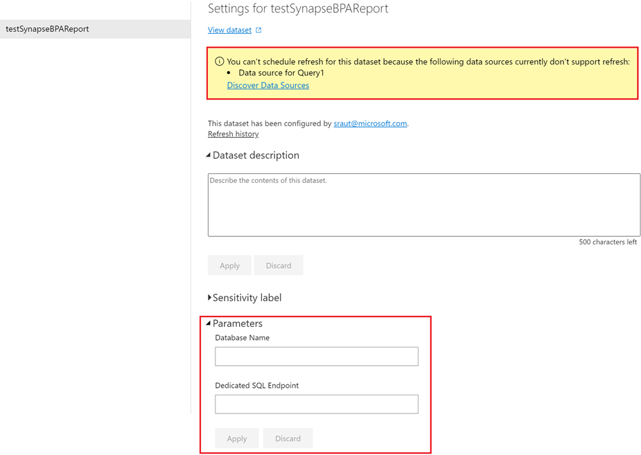

Click on “Discover Data Sources” link after you applied parameters in above step. This will populate data source information from parameters you provided.

You will then see option for data source credentials and Gateway connection as shown in figure below. 

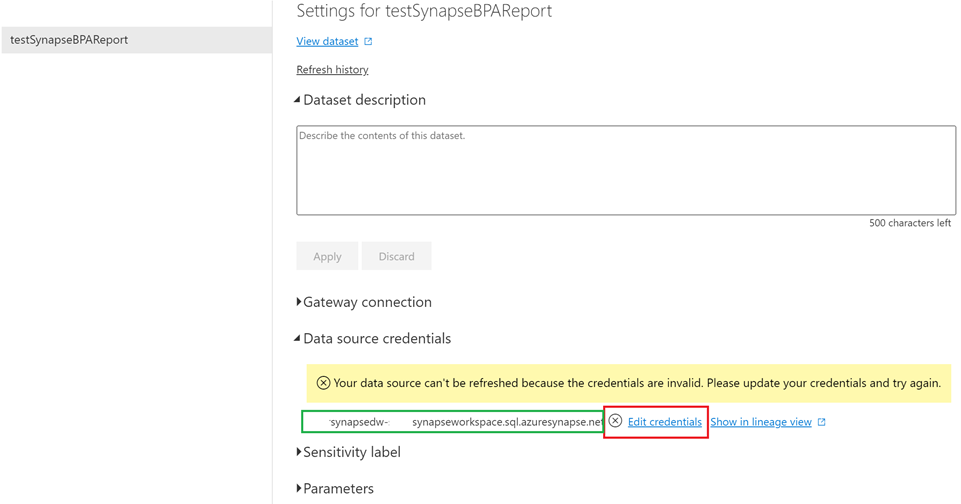

Click Edit Credentials to provide login credentials to your Synapse Dedicated endpoint. (the credentials should have sysadmin rights on the Synapse Database)

If you have configured your synapse datasource to be available behind virtual private network, go to Gateway connection option and choose right gateway datasource from your gateways.  For more help on how to configure data source on gateway please see [Use the data source with Scheduled refresh](https://docs.microsoft.com/en-us/power-bi/connect-data/service-gateway-enterprise-manage-sql#use-the-data-source-with-scheduled-refresh "Use the data source with Scheduled refresh"). For more details on how to create gateway data source you can refer [Add or remove a gateway data source](https://docs.microsoft.com/power-bi/connect-data/service-gateway-data-sources "Add or remove a gateway data source").

After above step, now refresh dataset by clicking refresh now

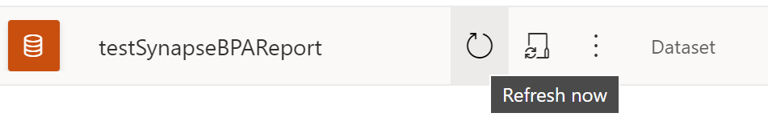

## Other errors when refreshing report from Power BI Desktop

Sometimes you may see following error like “Query ‘Query Name’ (step ‘step name’) reference other queries or steps… please rebuild this data combination”

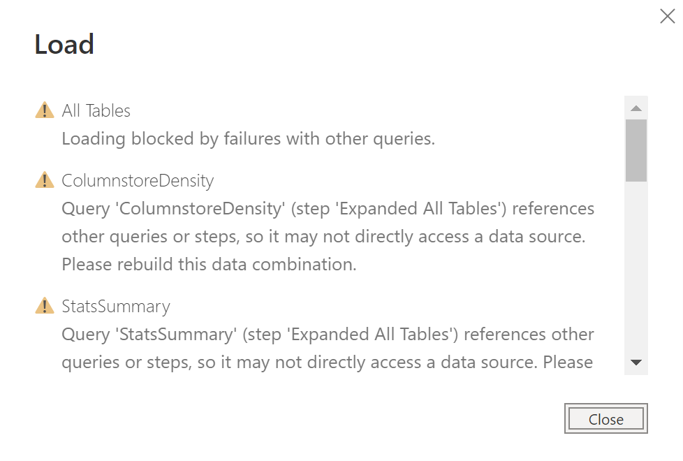

This error happens only in desktop due to some internal race condition. There are two ways to fix it. You can either publish a report to Power BI service using steps mentioned in timeout error section

Alternatively, you can use following technique to “refresh all” preview from transform data screen. For this go to transform data to open Power Query editor. 

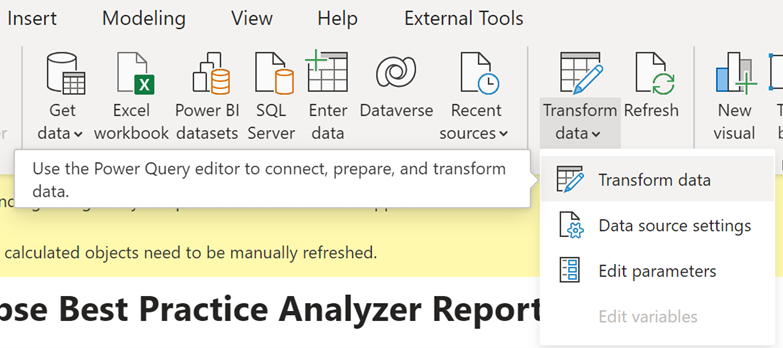

In Power Query editor, under Queries pane, click on “All Tables” query.

Expand “Refresh Preview” and click “Refresh All”.

Wait for preview refresh to complete.

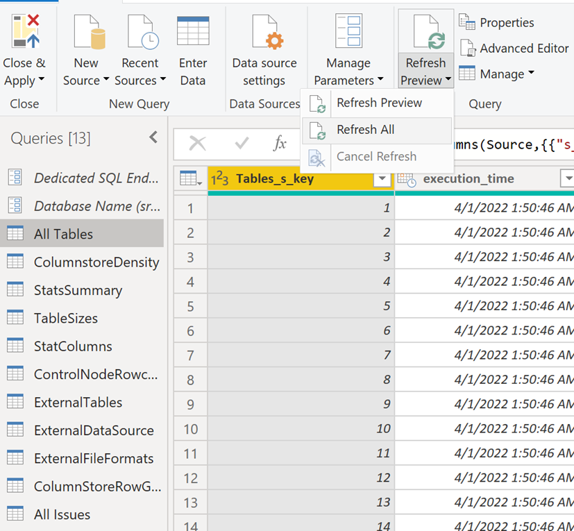

Once preview is refreshed you can click” Close & Apply” button on the left corner of navigation ribbon. 

This will restart the refresh.
