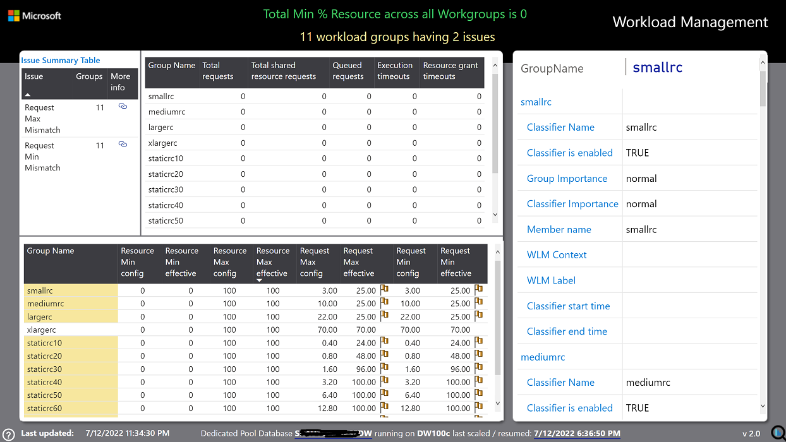

# Updates to Synapse Analyzer Report – Workload Management and support for XL data warehouses.

In May 2022 we released the first version of Synapse Analyzer Report that will help you with table, index, and statistics information and report issues on these topics. 

With help from Nick Salch, Fretz Nusan, and Synapse CSE team, today we have an update (v2.0) to the Synapse Analyzer report:

- Addition of Workload Management Report page to the existing report 
- A new separate CTAS version of Synapse Analyzer Report for extra-large data warehouses
- Fixed below error during desktop refresh 
  - Query 'Query Name’ (step 'Expanded All Tables') references other queries or steps, so it may not directly access a data source. Please rebuild this data combination.

## Addition of Workload Management Report page:
The new version (v2.0) contains additional reports to detect issues in configuration of Workload Management settings in Synapse Dedicated Pool.

Following is the brief description for the Workload Management report page. 

### Workload Management: 
This page provides information on workload management and related settings in Synapse dedicated pool. It highlights some of the common warnings admins should be aware of when setting the resource and request percentage for effective workload governance. Please review issues and warnings on this page to ensure you are using optimal strategy for your workload groups and classifiers. At any time you can click on ? icon on the visual to view more details on the guidance. 

### WLM Issue Summary: 
This table provides summary of all issues detected in your WLM environment. You can hover on each issue to find brief description and / or click on issue to find groups affected by respective issue. You can also click on URL link to find more information about workload management.

### Group Details: 
The table provides details for each workload group. Groups highlighted suggest there exist one or more issues for that group. You can hover on the groups flagged to find issues identified for that group. 
- Flag for effective values suggests there is mismatch between config and effective value at request or resource level. 
- Flag on request min config suggests mismatch in request min vs request max values. 
- Flag on resource min config suggests deviations in resource min configurations.

### Requests / Timeouts Summary: 
The table provides snapshot of requests and timeouts summary at the time when data was last refreshed / updated. 

The table below provides details on issues that have been added for workload management. 

| Issue | Issue Description |
| ----------- | --------------------------------- | 
| **Importance Mismatch** | Mismatch in workload group importance and workload classifier importance for a workload group. Importance can be set separately at the workload group or workload classifier level. Whichever importance is higher is the one that will be assigned to the query. This test is just to make the user aware that there are two different importance set to make sure there is no confusion on the classified query's importance. Refer [Workload Management](https://docs.microsoft.com/en-us/azure/synapse-analytics/sql-data-warehouse/resource-classes-for-workload-management "Workload management with resource classes in Azure Synapse Analytics") for details.|
| **Request Max Mismatch** | Mismatch in configured and effective values of max request grant percentage for a workload group. The system will allow you to set any valid values for your request max and this will be your configured or desired value. The effective value is the actual value that is being used based on the configuration of other workload groups in the system. If your request max is set to 100%, but there is another workload group with a 10% minimum, then your effective request max will be lowered to 90%. Refer [Workload Management](https://docs.microsoft.com/en-us/azure/synapse-analytics/sql-data-warehouse/resource-classes-for-workload-management "Workload management with resource classes in Azure Synapse Analytics") for details.|
| **Request Min Mismatch** | Mismatch in configured and effective values of min request grant percentage for a workload group. The system will allow you to set any valid values for your request minimum and this will be your configured or desired value. The effective value is the actual value that is being used based on the configuration of other workload groups in the system. If your request min is set to 50%, but there are other workload groups with combined minimums totaling 60%, then your effective request min will be lowered to 40%. Refer [Workload Management](https://docs.microsoft.com/en-us/azure/synapse-analytics/sql-data-warehouse/resource-classes-for-workload-management "Workload management with resource classes in Azure Synapse Analytics") for details.|
| **Resource Max Mismatch** | Mismatch in configured and effective values of cap resource percentage for a workload group. The system will allow you to set any valid values for your resource max (workload group max) and this will be your configured or desired value. The effective value is the actual value that is being used based on the configuration of other workload groups in the system. If your resource max is set to 100%, but there is another workload group with a 10% minimum, then your effective resource max will be lowered to 90%. Refer [Workload Management](https://docs.microsoft.com/en-us/azure/synapse-analytics/sql-data-warehouse/resource-classes-for-workload-management "Workload management with resource classes in Azure Synapse Analytics") for details.|
| **Resource Min Mismatch** | Mismatch in configured and effective values of min resource percentage for a workload group. The system will allow you to set any valid values for your resource minimum and this will be your configured or desired value. The effective value is the actual value that is being used based on the configuration of other workload groups in the system. If your resource minimum is set to 50%, but there are other workload groups with combined minimums totaling 60%, then your effective request min will be lowered to 40%. Refer [Workload Management](https://docs.microsoft.com/en-us/azure/synapse-analytics/sql-data-warehouse/resource-classes-for-workload-management "Workload management with resource classes in Azure Synapse Analytics") for details.|
| **Resource Min NonZero** | Resource min percentage is nonzero for a workload group. You can set a workload group to have a minimum percentage allocated at all times, this is true regardless of whether or not there are queries running in this group. This test is to notify the user that there is a group that has a permanent resource grant because it will lower the concurrency resources available to all other groups and in many cases lower your overall concurrency. Refer [Workload Management](https://docs.microsoft.com/en-us/azure/synapse-analytics/sql-data-warehouse/resource-classes-for-workload-management "Workload management with resource classes in Azure Synapse Analytics") for details.|
| **Resource Min Over10%** | Resource min percentage is > 10% for a workload group. When you set a workload group minimum it is allocated at all times regardless of whether or not there are queries running in this group. If this minimum is set to high then it can have a dramatic effect on the overall concurrency available to the system since queries not in this group can never tap into this granted percentage. There may be rare scenarios where this is a valid configuration such as a fairly constant workload that regularly uses more than this minimum, but you are more likely to achieve higher concurrency by removing or lowering this minimum, capping certain workloads, and allowing the shared resources to be dynamically allocated based on importance. Refer [Workload Management](https://docs.microsoft.com/en-us/azure/synapse-analytics/sql-data-warehouse/resource-classes-for-workload-management "Workload management with resource classes in Azure Synapse Analytics") for details.|
| **Request Min vs Request Max mismatch** | Request min grant percentage and request max grant percentage do not match for a workload group. On a per-request basis within a workload group you can set a separate minimum and maximum resource grant. If there are enough resources available it will grant the maximum, but if there are not it will lower the allocation until it gets to the minimum at which point if there are still not enough resources the query will queue. However, in most scenarios you do not want to set a separate minimum and maximum request grant because it could result in varying query runtimes based on how large of a grant the query is given at different times. Refer [Workload Management](https://docs.microsoft.com/en-us/azure/synapse-analytics/sql-data-warehouse/resource-classes-for-workload-management "Workload management with resource classes in Azure Synapse Analytics") for details.|

## CTAS version for XL data warehouses
With this update we are also bringing a parallel copy of Synapse Analyzer report specifically targeted towards scenarios where Synapse Dedicated Pool database has greater than 20K tables and the normal refresh of synapse analyzer report times out after long period (greater than 5 hours)

For this version of the report the Synapse Admin has to run the Create table script on the dedicated Pool database which is being analyzed. The script will 

- a. Create new schema named “SynapseAnalyzer” under same database
- b. Execute Create Table as Select (CTAS) statements to create tables in SynapseAnalyzer schema and prepopulate it with details from the same database. 
- c. These tables are then used as source for the Power BI template file “Synapse best practice analyzer_with_CTAS.pbit” 
- d. The PBI template will then connect to SynapseAnalyzer schema and pull all the information from the tables that are prepopulated in above steps.  

**Important**: You need to run the scripts in given order.

1. The “CreateTablesForSynapseAnalyzer_CTAS.sql” script creates new schema named “SynapseAnalyzer” and then creates all required tables as a part of CTAS
2. Only after  step 1 above is successfully complete you can use “Synapse best practice analyzer_with_CTAS.pbit” for creating report using the PBI template file.

## Fixed error during desktop refresh 
For many users, running load data through Power BI desktop, the “Load Data” used to turn out into following error. 

    All Tables
    Loading blocked by failures with other queries.
    ColumnstoreDensity
    Query 'ColumnstoreDensity' (step 'Expanded All Tables') references other queries or steps, so it may not directly access a data source. Please rebuild this data combination.
    StatsSummary
    Loading blocked by failures with other queries.
    TableSizes
    Query 'TableSizes' (step 'Expanded All Tables') references other queries or steps, so it may not directly access a data source. Please rebuild this data combination.
    …

While there was a details section in Troubleshooting document on github location for troubleshooting this error, the overall first experience with tool was not optimal. With a new version of Synapse Analyzer report we have fixed this issue so you should not be getting the above error.

In future we plan to continue with more features and reports.

Thank you very much for using Synapse Analyzer. As always, we would be happy to receive any feedback you may have on the report. 

